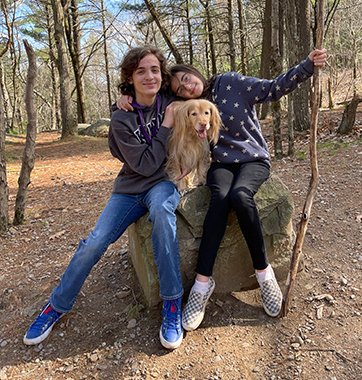

Hello, my name is Christine Gaudette and I am from Brookline, MA. I am currently working on getting my Bachelors Degree in Graphic Information Technology (Full-Stack Web Development) at Arizona State University. I am a stay-at-home mom raising my two beautiful children with my husband of 28 years. In my spare time when my children are in school, I am a potter and ride share driver. When my son was born 17 years ago, I left my job at Monster.com. I started there as an intern in 1998 and held roles from Sr. Web Developer to Manager of Web Services in the years that followed. I have been out of this industry for the past 17 years and I believe a BS in Graphic Information Technology (Full-Stack Web Development) will complement my past experience as I return to the field.

## My kids and dog

<!--
**cgaudette66/cgaudette66** is a ✨ _special_ ✨ repository because its `README.md` (this file) appears on your GitHub profile.

Here are some ideas to get you started:

- 🔭 I’m currently working on ...
- 🌱 I’m currently learning ...
- 👯 I’m looking to collaborate on ...
- 🤔 I’m looking for help with ...
- 💬 Ask me about ...
- 📫 How to reach me: ...
- 😄 Pronouns: ...
- ⚡ Fun fact: ...
-->

